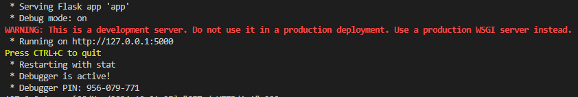
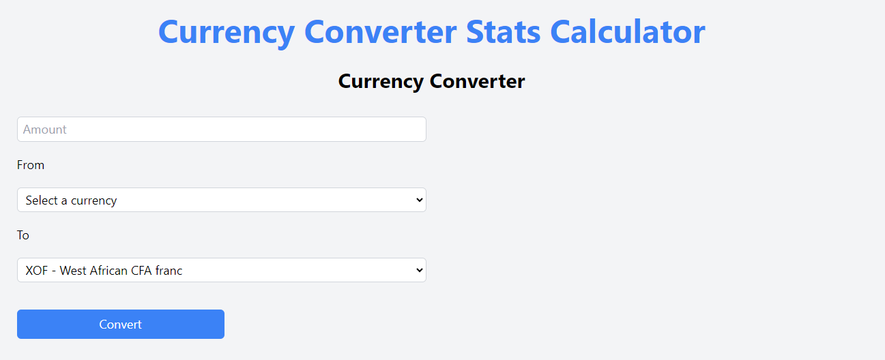
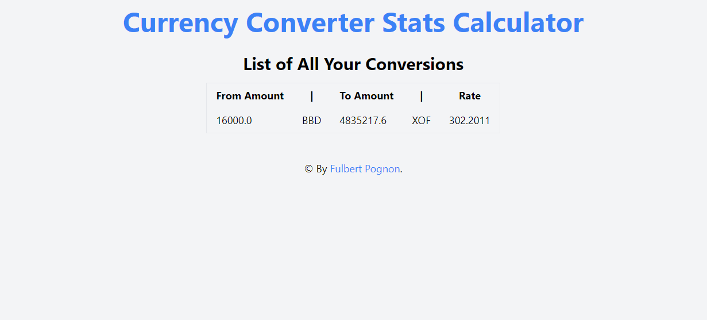
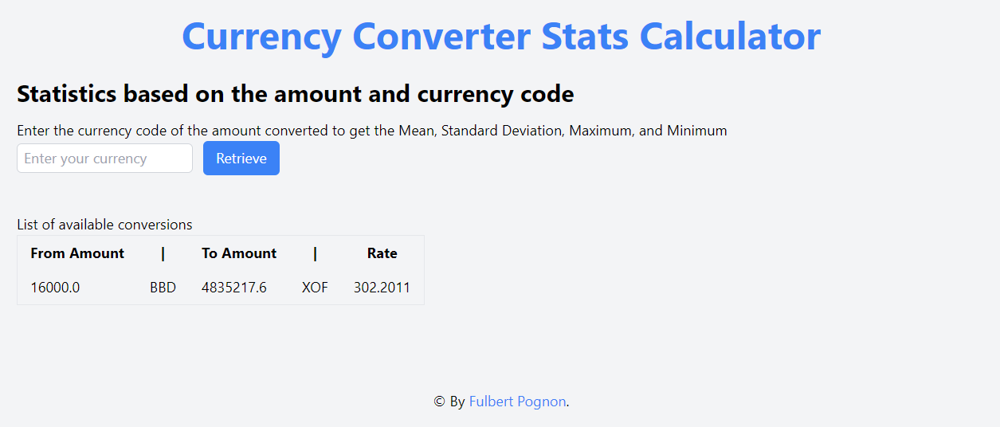
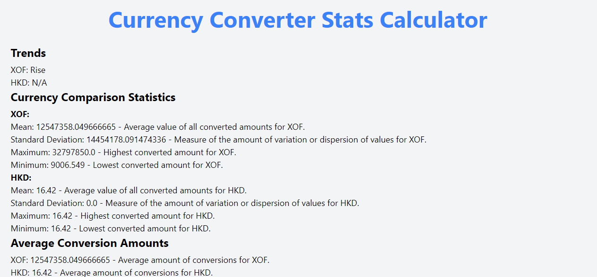

# currency-converter-stats-calculator

Web Application to Convert Currencies and Perform Calculations Statistics

# Engineering Department Codebase Setup Guide

This guide provides step-by-step instructions for setting up the development environment for the Engineering department's codebase. The codebase utilizes Python with Flask for the backend and Tailwind CSS for the frontend.

## Prerequisites

Before you begin, ensure you have the following software installed on your system:

- [Python](https://www.python.org/)
- [Node.js](https://nodejs.org/en)
- [Git](https://git-scm.com/)

## Getting Started

### Clone the Repository (Optional)

1. Open a terminal or command prompt.
2. Navigate to the directory where you want to store the codebase.
3. Run the following command to clone the repository:
   ```
   git clone https://github.com/YvesleCurseur/currency-converter-stats-calculator.git
   ```

### Directory Structure (Before Setup the App)

```
currency-converter-stats-calculator/
│
├── screenshots/
│
└── static/
|   └── css
|       └── input.css
|       └── output.css
|
├── templates/
│   └── base.html
│   └── conversions.html
│   └── convert.html
│   └── statistics.html
│   └── trends.html
|
├── utils/
│   └── currency_codes.py
│   └── statistics.py
|
├── templates/
│   └── base.html
│   └── conversions.html
│   └── convert.html
│   └── statistics.html
│   └── trends.html
|
├── .gitignore
├── app.py
├── config.py
├── env.example
├── models.py
├── package-lock.json
├── package.json
├── README.md
├── requirements.txt
└── tailwind.config.js
```

In this structure:

- `currency-converter-stats-calculator/`: Directory for the codebase.
- `screenshots/`: Directory for screenshots.
- `static/`: Directory for static files like CSS.
- `templates/`: Directory for HTML templates.
- `utils/`: Directory for utility modules or functions.
- `app.py`: Main application file.
- `.gitignore`: List of ignored files and directories.
- `config.py`: Configuration file for Flask.
- `models.py`: Contains database models and request to the database.
- `requirements.txt`: List of required packages for flask.
- `env.example`: Example .env file.
- `package.json`: List of required packages for npm and Tailwind CSS.
- `tailwind.config.js`: Tailwind CSS configuration file.
- `README.md`: Project documentation.

### Create a Virtual Environment

1. Navigate to the root directory of the cloned repository.
2. Run the following command to create a virtual environment:
   ```
   python -m venv venv
   ```
3. Activate the virtual environment:
   ```
   .\venv\Scripts\activate
   ```
   or
   ```
   source venv/bin/activate
   ```

### Create the environment variables

This application utilizes environment variables for configuration.

Change the `env.example` to a `.env` file in the root directory. Add the following variables:

Ensure the following environment variables are set:

```
FLASK_APP=app
ENV=DEVELOPEMENT
FLASK_DEBUG=True

# Amdoren Currency Converter
EXCHANGE_API_KEY="Your API key for accessing the ExchangeRate-API."
EXCHANGE_URL="https://v6.exchangerate-api.com/v6"
```

Use the API key from the ExchangeRate-API by [signing up](https://app.exchangerate-api.com/sign-in) for an account or use this one here:

```
9328d7790738eab570d5c8a4
```

### Install Dependencies

1. Navigate to the root directory of the cloned repository.
2. Install Python dependencies:
   ```
   pip install -r requirements.txt
   ```
3. Install Node.js dependencies:
   ```
   npm install
   ```

### Running the Codebase

1. To enable the Tailwind CSS style, build the CSS file:
   ```
   npm run buildcss
   ```
2. Start the Flask app by running:
   ```
   flask run
   ```
3. Navigate to http://127.0.0.1:5000 in your browser.
   In your terminal, you should see the following output:
   

#### Note:

In the directory of the codebase, you should be able to see a `currency_data.db` appearing.

### Directory Structure (After Launching the App)

```
currency-converter-stats-calculator/
│
├── screenshots/
│
└── static/
|   └── css
|       └── input.css
|       └── output.css
|
├── templates/
│   └── base.html
│   └── conversions.html
│   └── convert.html
│   └── statistics.html
│   └── trends.html
|
├── utils/
│   └── currency_codes.py
│   └── statistics.py
|
├── templates/
│   └── base.html
│   └── conversions.html
│   └── convert.html
│   └── statistics.html
│   └── trends.html
|
├── venv/
│
├── .env
├── .gitignore
├── app.py
├── config.py
├── currency_data.db
├── models.py
├── package-lock.json
├── package.json
├── README.md
├── requirements.txt
└── tailwind.config.js
```

## Troubleshooting

- **Dependency Issues**: Ensure correct versions of Python and Node.js/npm are installed. Check `requirements.txt` and `package.json` for correct dependencies.
- **Flask App Not Running**: Check for missing dependencies or incorrect configurations in the Flask application.
- **Tailwind CSS Build Error**: Verify paths in `tailwind.config.js` for input and output files.

## Main Functions Overview to Resolve the Test

In utils/statistics.py, you can find the following functions:

1. `calculate_statistics_for_currency(currency_code)`

This function calculates the statistics of all amounts converted for a specified currency.

2. `compare_statistics_for_currencies()`

This function compares the statistics of all amounts converted for each currency available in the database.

3. `calculate_mean_conversion_amounts_by_currency()`

This function calculates the mean conversion amounts for each currency and provides trend messages indicating whether the conversion amounts are rising, dropping, or stable.

## Additional Information

Here some screenshots of the application:





